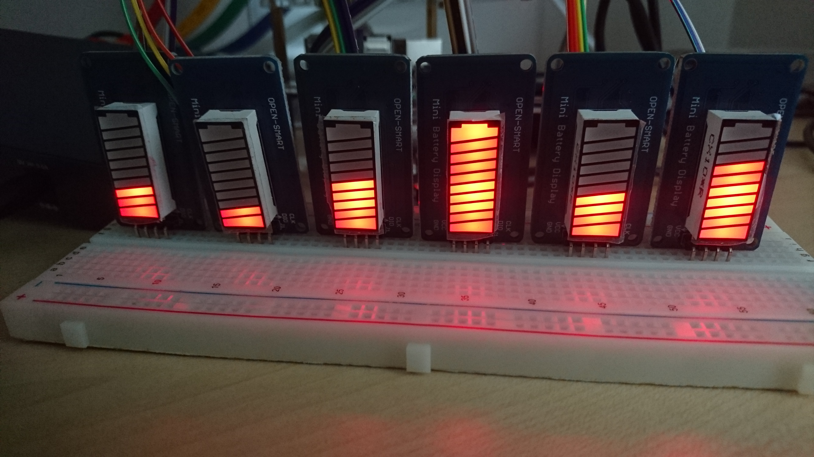

# RPi Mini Battery Display

[](https://github.com/koenvervloesem/rpi-mini-battery-display/actions)
[](https://pypi.org/project/rpi-mini-battery-display)
[](https://www.python.org)
[](https://github.com/koenvervloesem/rpi-mini-battery-display/blob/master/LICENSE)

Library and command-line program to control 10-segment mini battery displays based on the TM1651 chip, such as [the ones from Open-Smart](https://aliexpress.com/item/32789343210.html), on a Raspberry Pi.

## System requirements

The rpi-mini-battery-display library is written to run on a Raspberry Pi. It has been tested on Raspbian Buster (10) with Python 3.7.

If you don't have pip, install it first with:

```shell
sudo apt install python3-pip
```

This library uses the [RPi.GPIO](https://pypi.org/project/RPi.GPIO/) library to communicate with the TM1651 chip. The default user `pi` in Raspbian has already the right permissions for GPIO access. If you want to use the library as another user, the user needs to be in the `gpio` group to have the right permissions. This can be done with:

```shell
sudo adduser $USER gpio
```

## Installation

```shell
sudo pip3 install rpi-mini-battery-display
```

## Connections

The mini battery display should be connected like this to the Raspberry Pi's GPIO header:

Mini Battery Display | Raspberry Pi
-------------------- | ------------
CLK                  | BCM24
DIO                  | BCM23
VCC                  | 5 V
GND                  | GND

See [pinout.xyz](https://pinout.xyz/) for the Raspberry Pi GPIO pinout.

The CLK and DIO pin can be connected to other pins on the Raspberry Pi, but these are the default values used by the code. If you change the connections, you have to supply the other pin values as parameters to the software.

## Usage

You can use the `rpi-mini-battery-display` program to set the level of the battery display from 0 to 7 or to let it show the CPU percentage as a level from 0 (less than 12.5%) to 7 (more than 87.5%):

```shell
usage: rpi-mini-battery-display [-h] [-c CLOCK_PIN] [-d DATA_PIN]
                                [-b BRIGHTNESS] (-l LEVEL | -p)

Control a 10 LED mini battery display with TM1651 chip

optional arguments:
  -h, --help            show this help message and exit
  -c CLOCK_PIN, --clock-pin CLOCK_PIN
                        Clock pin in BCM notation (default: 24, range: 0-27)
  -d DATA_PIN, --data-pin DATA_PIN
                        Data pin in BCM notation (default: 23, range: 0-27)
  -b BRIGHTNESS, --brightness BRIGHTNESS
                        Brightness (default: 2, range: 0-7)
  -l LEVEL, --level LEVEL
                        Set battery level (range: 0-7)
  -p, --processor       Show CPU percentage
```

## Use cases

These displays are handy in every situation where you want to show a status on a Raspberry Pi on a low budget. For instance, I'm using them to show the CPU load of every Raspberry Pi in my six-node cluster:



This was actually my motivation to develop the rpi-mini-battery-display library.

## Changelog

* 0.3.0 (2020-02-28): Refactored code from rather C++/Arduino-like to something more Pythonic
* 0.2.0 (2020-01-27): Added option to show the CPU percentage
* 0.1.0 (2020-01-26): Initial version

## TODO

* Individually address the LED segments instead of only using them as a LED bar (fairly trivial, I already played with it but haven't implemented the necessary method yet).
* Add the possibility to switch the direction of the LED bar.
* Add static typing with [mypy](http://mypy-lang.org/).
* Support other versions of the mini battery displays based on the TM1651 chip, for instance [the 5-segment one](https://aliexpress.com/item/2025558433.html).
* Support other mini battery displays, such as the [Grove LED Bar](https://wiki.seeedstudio.com/Grove-LED_Bar/), which uses the MY9221 chip.

## Developer notes

* The TM1651 is one of a series of LED driver control chips by Titan Micro Electronics. Other popular similar chips of the same manufacturer are the TM1637 and TM1640.
* [English datasheet of the TM1651](http://aitendo3.sakura.ne.jp/aitendo_data/product_img/ic/LED-driver/TM1651_%20V1.2/TM1651_V1.1_EN.pdf)

## License

This project is provided by [Koen Vervloesem](mailto:koen@vervloesem.eu) as open source software with the MIT license. See the LICENSE file for more information.
